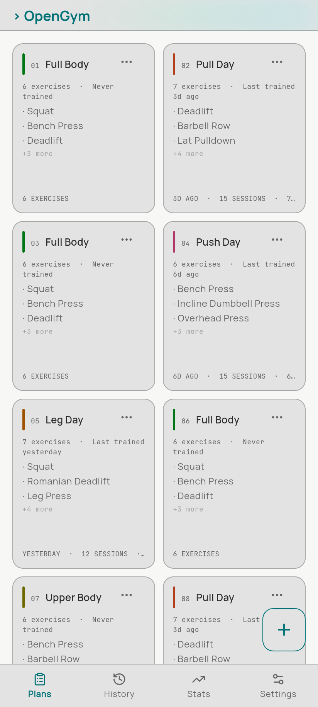
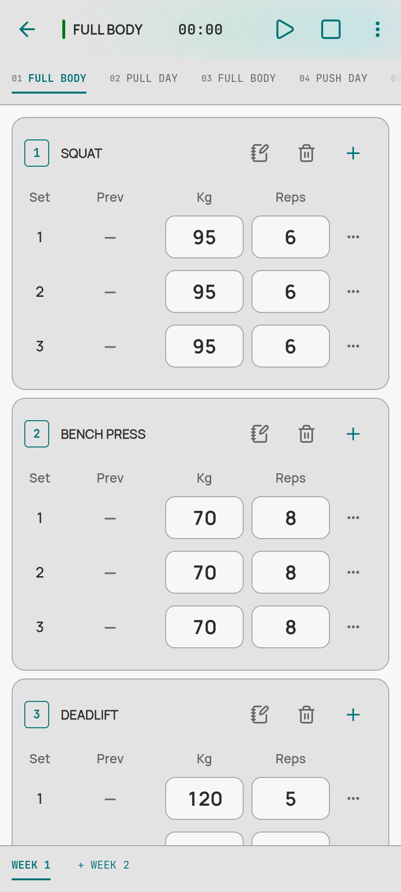
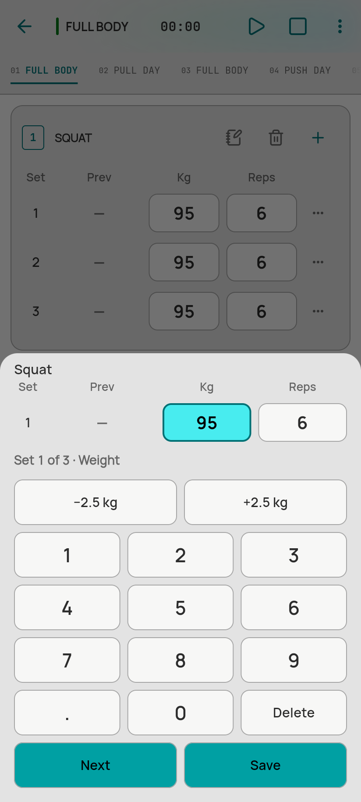
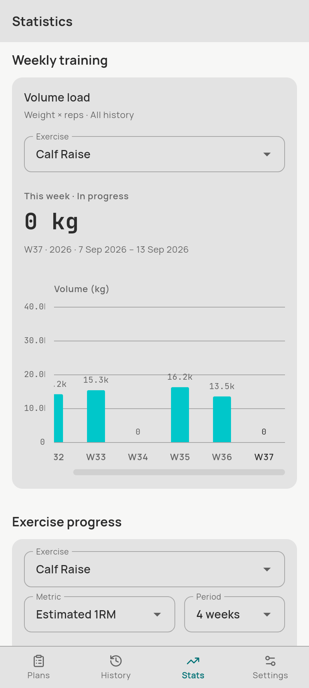

# OpenGym Product Page

The landing page and product showcase for [OpenGym](https://github.com/AalishMS/OpenGym), an offline-first workout tracking application for Android.

Built with React 19, TypeScript, and Vite.

## Screenshots

| Routine & Plans | Active Workout | Custom Keypad | Analytics |
| :---: | :---: | :---: | :---: |
|  |  |  |  |

## Features

- **Interactive 3D Phone Mockup:** Responsive phone mockup with pointer tilt effect on desktop and reduced-motion fallback.
- **Walkthrough Story:** Step-by-step presentation of core app flows (planning, logging, tracking progress) synced to scroll position.
- **Set Logging Demo:** Live interactive component demonstrating the in-app set logging interface (weight, reps, RPE).
- **Theme Switcher:** Live preview showing the 7 accent color themes available in OpenGym.
- **Offline Architecture:** Explains the local SQLite storage model and optional cloud sync.
- **FAQ Section:** Answers common questions about data export, APK installation, and sync.

## Tech Stack

- **Framework:** React 19
- **Language:** TypeScript
- **Build Tool:** Vite 8
- **Animation:** Framer Motion
- **Linter:** Oxlint
- **Styles:** Plain CSS with CSS custom properties
- **Fonts:** Space Grotesk, Inter, JetBrains Mono

## Project Structure

```
OpenGym_Product_Page/
├── public/
│   ├── applogo.png
│   ├── icons.svg
│   ├── og-image.png
│   └── screenshots/
│       ├── home.png
│       ├── home_dark.png
│       ├── statistics.png
│       ├── workout.png
│       └── workout_keypad.png
├── src/
│   ├── components/
│   │   ├── FAQ.tsx
│   │   ├── Footer.tsx
│   │   ├── Header.tsx
│   │   ├── Hero.tsx
│   │   ├── LoggingDemo.tsx
│   │   ├── OfflineSection.tsx
│   │   ├── Personalization.tsx
│   │   ├── PhoneFrame.tsx
│   │   └── ProductStory.tsx
│   ├── App.tsx
│   ├── config.ts
│   ├── index.css
│   └── main.tsx
├── index.html
├── package.json
├── tsconfig.json
└── vite.config.ts
```

## Getting Started

### Prerequisites

- Node.js 18+
- npm, pnpm, or yarn

### Installation

```bash
git clone https://github.com/AalishMS/OpenGym-Product-Page.git
cd OpenGym-Product-Page
npm install
```

### Development

```bash
npm run dev
```

Starts the local development server at `http://localhost:5173`.

### Production Build

```bash
npm run build
```

Compiles TypeScript and bundles production assets into `dist/`.

To test the production build locally:

```bash
npm run preview
```

### Linting

```bash
npm run lint
```

Runs Oxlint across the project.

## Configuration

Site copy, download links, sample workouts, FAQ items, and theme palettes are defined in [`src/config.ts`](./src/config.ts). Update this file to modify content without changing component code.

## Related Links

- [OpenGym Mobile App](https://github.com/AalishMS/OpenGym) — Flutter mobile application repository
- [OpenGym Releases](https://github.com/AalishMS/OpenGym/releases/latest) — Latest Android APK downloads
- [OpenGym JSON Editor](https://github.com/AalishMS/OpenGym-JSON-Editor-) — Web tool for editing workout JSON files

## License

This project is open-source under the MIT License.
